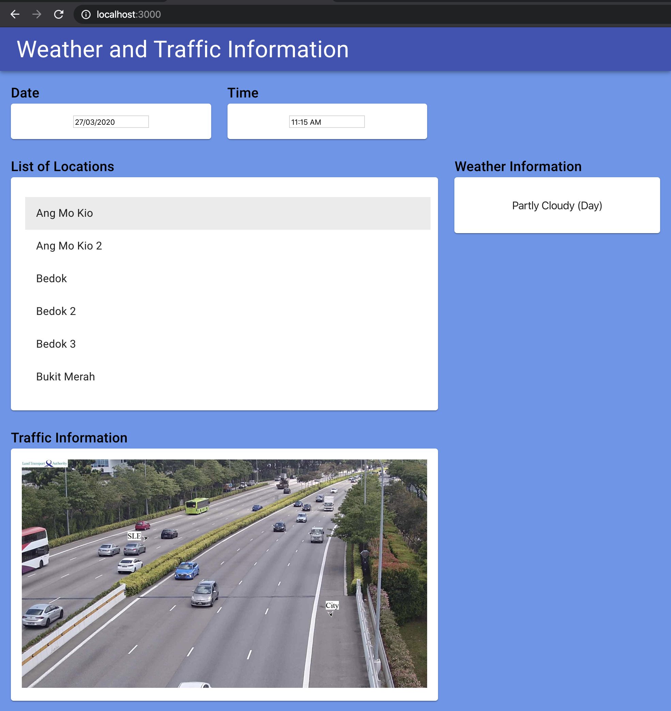
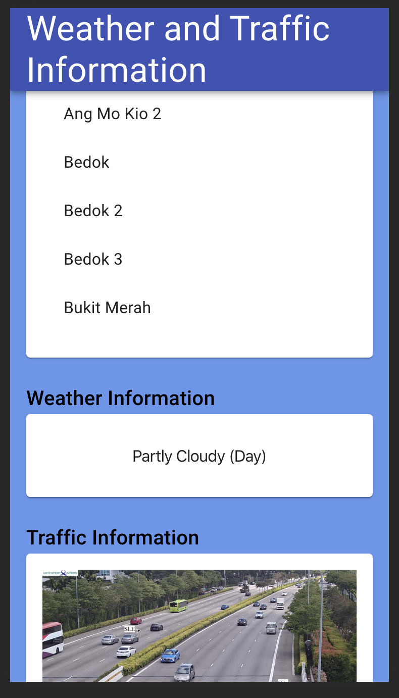

## Running the app

1. Clone the Repo into your local machine.
2. Use `yarn start` to begin running the app.

This runs the app in the development mode. 
Open [http://localhost:3000](http://localhost:3000) to view it in the browser.

## How the app looks

#### On desktop

#### On mobile

Note that the current **Date** and **Time** will be used by default. 
Change them to view results of your desired date and time.